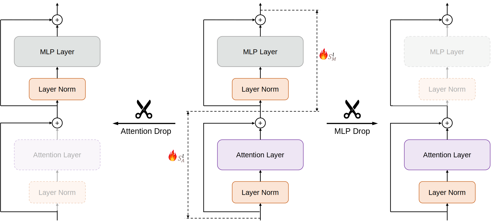

We conduct extensive experiments and analysis to reveal the architecture redundancy within transformer-based Large Language Models (LLMs). 
Pipeline for Block Drop and Layer Drop is based on the [LLaMA-Factory](https://github.com/hiyouga/LLaMA-Factory).
The quantization is implemented based on the [AutoAWQ](https://github.com/casper-hansen/AutoAWQ) and [AutoGPTQ](https://github.com/AutoGPTQ/AutoGPTQ).

## Introduction
Transformer-based large language models (LLMs) often contain architectural redundancies. In this work, we systematically investigate redundancy across different types of modules, including Blocks, Attention layers, and MLP layers. Surprisingly, we found that Attention layers, the core component of transformers, are particularly redundant. For example, in the Llama-3-70B model, **half of the Attention layers can be dropped** while maintaining performance. 
Our observations indicate that this redundancy in Attention layers persists throughout the training process, necessitating Attention Drop.
Additionally, dropping Attention layers significantly enhances computational and memory efficiency. 
Our findings are informative for the ML community and provide insights for future architecture design.




## Quick Start

#### Installation

```bash
python3 -m venv env
source env/bin/activate
pip3 install -r requirements.txt
```

## Prepare Models
Download the models (e.g., Mistral-7B, Llama-2 and Llama-3) from HuggingFace. We create [new config and modeling files]([(https://github.com/vicky157/llm-pruning/tree/main/src/llmtuner/compression/prune/models)]) to represent the models by layers or blocks. 
The key ``auto_map`` needs to be added in the config.json to utilize the new files. 
Take Mistral-7B as an example: 
```json
"auto_map": {
    "AutoConfig": "configuration_dropped_mistral.MistralConfig",
    "AutoModelForCausalLM": "modeling_dropped_mistral.MistralForCausalLM"
  },
```
Additionally, the key ``drop_attn_list`` and ``drop_mlp_list`` respectively mark which Attention layers and MLPs should be dropped based on their layer index. For instance, 

#### Drop 4 Attention layers:
```json
 "drop_mlp_list": [],
 "drop_attn_list": [25, 26, 24, 22],
```
#### Drop 4 MLPs layers:
```json
 "drop_mlp_list": [26, 27, 25, 24],
 "drop_attn_list": [],
```
#### Drop 4 Blocks:
```json
 "drop_mlp_list": [26, 25, 24, 27],
 "drop_attn_list": [26, 25, 24, 27],
```

## Run Dropping

#### Block Drop
```bash
bash scripts/dropping/block_drop.sh
```

#### Layer Drop
```bash
bash scripts/dropping/layer_drop.sh
```

#### Joint Layer Drop
```bash
bash scripts/dropping/layer_drop_joint.sh
```
These bash scripts will generate the importance scores for blocks/layers, determine which blocks/layers to retain, and create new model configuration files indicating the dropped modules.

## Benchmarks
#### Performance
Evaluate the performance of the model with dropping some modules on specific tasks:
```bash
bash scripts/benchmark/benchmark_lm_eval.sh
```

The evaluation code is based on [EleutherAI/lm-evaluation-harness](https://github.com/EleutherAI/lm-evaluation-harness). To fully reproduce our results, please use [this version](https://github.com/s1ghhh/lm-evaluation-harness). It samples few-shot based on the index of the samples, avoiding the issue of result variation with the number of processes during data parallel inference.
Remember to use the modeling files in `src/llmtuner/model` to load the Mistral and Llama models.

#### SpeedUp
Evaluate the speedup ratio of the model with dropping some modules:
```bash
bash scripts/benchmark/benchmark_speed.sh
```

#### Quantization
Please refer to [AutoGPTQ](https://github.com/AutoGPTQ/AutoGPTQ) and [AutoAWQ](https://github.com/casper-hansen/AutoAWQ). Ensure you carefully install the packages that correspond to your CUDA version.
For quantization, use the following scripts:
```bash
bash scripts/quantization/awq.sh
bash scripts/quantization/gptq.sh
```


